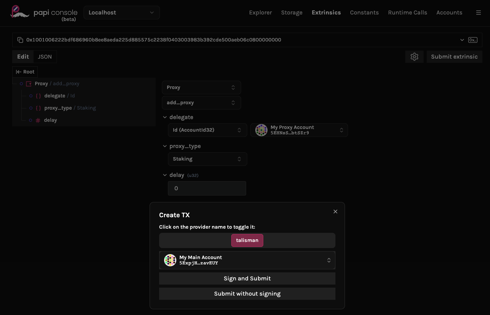
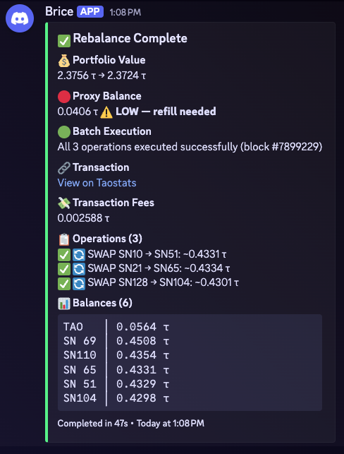

# brice-tao

Automated portfolio rebalancer for [Bittensor](https://bittensor.com/) subnets. Monitors subnet performance, selects optimal allocation targets via pluggable strategies, and executes on-chain staking operations through a proxy account — with MEV protection, slippage simulation, and Discord notifications.

## Strategies

The bot ships with four strategies. Select one with `--strategy <name>` or the `STRATEGY` env var (defaults to `root-emission`).

| | root-emission | copy-trade | sma-stoploss | coward |
|---|---|---|---|---|
| **Approach** | Fixed % to root (SN0), rest to best emission-yield subnet | Mirror a leader wallet's portfolio proportions | SMA crossover momentum + emission yield scoring | 100% to SN0 (root), switches validator for ≥1% yield improvement |
| **Scheduling** | Cron (every 12 h) | Event-driven (leader staking events) | Block-interval (~4 h) | Cron (every 24 h) |
| **# Slots** | 2 (root + alpha) | Dynamic (matches leader) | 3 fixed (33% each, unfilled → SN0) | 1 (root only) |
| **Risk management** | Simple (fixed root allocation) | Follows leader | Fixed % trailing stop-loss | Maximum safety (all root) |
| **State** | Stateless | Stateless | Persistent (SQLite price history) | Stateless |
| **Complexity** | Low | Low | Medium | Minimal |
| **Best for** | Small portfolios, passive yield | Tracking an expert allocator | Trend-following with downside protection | Risk-off / capital preservation |

Each strategy has its own `config.yaml` with tunable parameters — see `src/strategies/<name>/config.yaml`.

> **Want to build your own?** See the [Custom Strategies Guide](docs/custom-strategies.md).

## Prerequisites

- [Bun](https://bun.sh) (for local development)
- [Docker](https://docs.docker.com/get-docker/) (for containerized deployment)
- A Bittensor account with TAO — your **main account** (coldkey)
- It's optional for the sake of open source but if you are serious about trading bots, you'll need an archive node RPC. Backtesting strategies and warming up bots require access to archive nodes. `onfinality.com` and `dwellir.com` provide nice free tiers, and much more for paid accounts.

### Accounts & security

The bot needs two things to operate:

1. The **address** of the account that holds your funds (your main account / coldkey)
2. The **recovery phrase** (mnemonic) of a separate account that has staking proxy permission on it

A bot has to sign transactions, which means it needs a mnemonic. But your main account's recovery phrase is the master key to all your funds — it should never live in a config file, on a server, or really on any computer at all. For any serious amount of TAO, your main account should be a [Ledger](https://www.ledger.com/) hardware wallet, where the mnemonic is generated on-device and never leaves it.

So instead of handing the bot your main mnemonic, you create a cheap throwaway account and grant it **staking-only** proxy permission over your main account. The bot signs with this proxy's mnemonic — it can stake and unstake on your behalf, but it cannot transfer funds out. If the server is compromised, the worst that can happen is some unwanted staking moves, not a drained wallet.

#### Set up the staking proxy

1. In [Talisman](https://www.talisman.xyz/), create a new account with a **fresh mnemonic**. This will be your proxy account — its mnemonic goes to the bot, so don't reuse it for anything else.
2. From your **main account** (Ledger or software wallet), submit a `Proxy -> addProxy` extrinsic on-chain: set the proxy account address as the delegate, `Staking` as the proxy type, and `0` delay. You can do this from [dev.papi.how](https://dev.papi.how) connected to a Bittensor RPC endpoint. 
3. Set `COLDKEY_ADDRESS` to the public address of your main account, and `PROXY_MNEMONIC` to the proxy account's mnemonic. **Never** put your main account's mnemonic in the bot config.

Fund the proxy account with a small amount of TAO for transaction fees — it doesn't need anything else.

## Configuration

### Environment variables

Set the following in your environment or `.env` file (see `.env.example`):

| Variable | Required | Description |
|----------|----------|-------------|
| `WS_ENDPOINT` | ✅ | RPC WebSocket endpoints (comma-separated for failover) |
| `COLDKEY_ADDRESS` | ✅ | Your coldkey SS58 address |
| `PROXY_MNEMONIC` | ✅ | Proxy account mnemonic (12 or 24 words) |
| `DISCORD_WEBHOOK_URL` | | Discord webhook for notifications (silent if unset) |
| `VALIDATOR_HOTKEY` | | Fallback validator when yield-based selection fails |
| `STRATEGY` | | Active strategy (default: `root-emission`) |
| `LEADER_ADDRESS` | | Leader coldkey to mirror (copy-trade strategy only) |
| `ARCHIVE_WS_ENDPOINT` | | Archive node endpoints for history warmup & backfill (comma-separated for failover) |
| `BACKFILL_CONCURRENCY` | | Parallel block fetches during backfill (default: `1`) |
| `BACKFILL_RPM` | | Max RPC requests per minute during backfill — `0` = unlimited (default: `0`) |
| `GIT_COMMIT` | | Git commit hash for log traceability (auto-detected locally; set via Docker build arg) |

### Strategy config

Environment variables are for secrets and connection strings only. Tunable parameters (slippage buffers, scoring weights, thresholds) live in each strategy's `config.yaml`:

- [`src/strategies/root-emission/config.yaml`](src/strategies/root-emission/config.yaml)
- [`src/strategies/copy-trade/config.yaml`](src/strategies/copy-trade/config.yaml)
- [`src/strategies/sma-stoploss/config.yaml`](src/strategies/sma-stoploss/config.yaml)
- [`src/strategies/coward/config.yaml`](src/strategies/coward/config.yaml)

### Discord notifications (optional)

The bot can send real-time alerts to a Discord channel — rebalance results, errors, and proxy balance warnings.

<details>
<summary>Example notification</summary>



</details>

To set it up:

1. Open your Discord server → **Server Settings** → **Integrations** → **Webhooks**
2. Click **New Webhook**, pick a channel, and optionally set a name/avatar
3. Click **Copy Webhook URL**
4. Set the `DISCORD_WEBHOOK_URL` environment variable to the copied URL

If not configured, the bot runs silently (terminal + file logs only).

## Quick Start

```bash
bun install
bun rebalance                                     # one-shot rebalance (default: root-emission)
bun rebalance -- --strategy copy-trade --dry-run   # dry run a specific strategy
bun preview   -- --strategy root-emission          # preview with audit report
bun scheduler                                      # long-running scheduler
bun scheduler -- --strategy sma-stoploss             # scheduler with specific strategy
bun bunker                                          # emergency exit: move all positions to SN0
bun bunker    -- --dry-run                          # preview bunker operations without executing
```

### `bun preview` vs `bun rebalance --dry-run`

These commands serve different purposes:

| | `bun preview` | `bun rebalance --dry-run` |
|---|---|---|
| **Purpose** | "Show me the plan" — quick, read-only analysis | "Rehearse the deployment" — full pipeline validation |
| **Requires secrets?** | No (`WS_ENDPOINT` + `COLDKEY_ADDRESS` only) | Yes (all production env vars including `PROXY_MNEMONIC`) |
| **Output** | Terminal audit tables + `reports/preview-*.md` | Terminal logs + decoded extrinsic JSON + log file |
| **Validates** | Strategy logic, allocation math, operation planning | Everything above + signer, proxy, MEV shield, slippage simulation |
| **Safe to share?** | Yes — no secrets needed or exposed | No — requires full production credentials |

## Docker

The container runs a long-lived scheduler process. Strategy configs are baked into the image at build time — rebuild after editing `config.yaml`. The `.env` file is mounted at runtime.

```bash
bun docker:run                   # build + start (git commit baked into logs)
bun docker:build                 # build only
docker compose down              # stop
docker ps                        # check status
cat logs/rebalance-*.log         # view execution logs (persisted on host)
```

Both `docker:*` scripts use `scripts/dc.sh`, which automatically passes the current git commit hash as a build arg so every log entry is traceable.

## Architecture

The rebalance pipeline:

```
Fetch Balances → Strategy Targets → Compute Operations → Simulate Slippage → MEV Shield → Execute → Verify → Notify
```

See [docs/architecture.md](docs/architecture.md) for the full system design.

### Key concepts

- **TAO/Alpha** — TAO is the base token (1 TAO = 10⁹ RAO). Alpha is a per-subnet staking token; staking TAO converts it via an AMM pool.
- **MEV Shield** — Transactions are encrypted (XChaCha20-Poly1305 + ML-KEM-768) before submission to prevent frontrunning.
- **Price limits** — U64F64 fixed-point values protecting swaps against slippage, computed via on-chain simulation.
- **Proxy account** — The bot signs with a staking-only proxy, never the coldkey. Limits blast radius.

### History database

All strategies record on-chain subnet data to a shared SQLite database (`data/history.sqlite`) for future backtesting. Data is stored on a fixed **25-block grid** (~5 minutes per sample) to balance resolution with disk usage.

- Every `block_number` in the DB satisfies `block_number % 25 === 0` — enforced by both code and a SQL CHECK constraint
- `recordCurrentBlock()` from `src/history/record.ts` is called by every strategy runner and silently skips non-grid blocks
- Backfill scripts must iterate in steps of `BLOCK_INTERVAL` (25) using helpers from `src/history/constants.ts`

### Backfilling history for backtests

Strategies that rely on historical data (e.g. `sma-stoploss`) and all backtesting require a populated history database. The DB is **not** populated automatically — you must backfill it from an **archive RPC node**.

**You need an archive node.** Standard (pruned) RPC endpoints only serve recent blocks. Archive nodes retain full chain history and are available from providers like [OnFinality](https://onfinality.io/), [Dwellir](https://dwellir.com/), and others. Set the endpoint in your `.env`:

```env
ARCHIVE_WS_ENDPOINT=wss://your-archive-node.example.com/ws
```

Then run the backfill:

```bash
bun backfill -- --days 30           # backfill the last 30 days
```

**Default settings are conservative.** The project defaults (`concurrency=1`, `rpm=unlimited`) are tuned for the lowest-tier archive node plans (e.g. free tiers on OnFinality or Dwellir). This avoids hitting rate limits but makes large backfills **extremely slow** — a 30-day backfill can take hours at concurrency 1.

**If you have a paid archive plan**, increase throughput via your `.env` or CLI flags:

```env
# .env — tune for your provider's rate limits
BACKFILL_CONCURRENCY=4    # parallel block fetches (default: 1)
BACKFILL_RPM=300           # max RPC requests/min, 0 = unlimited (default: 0)
```

CLI flags override env vars:

```bash
bun backfill -- --days 30 --concurrency 4 --rpm 300
```

> **Tip:** Start with modest values and increase gradually. If you see timeout errors or HTTP 429 responses, reduce concurrency or add an RPM cap. Backfills are resumable — already-fetched blocks are skipped on re-run.

## CI

All pushes and PRs to `main` are checked via GitHub Actions: lint, type-check, tests, and dead-code detection.

## Contributing

See [CONTRIBUTING.md](CONTRIBUTING.md) for code style, quality gates, and PR process.

## Why "brice-tao"?

The name is a nod to [**Brice de Nice**](https://en.wikipedia.org/wiki/Brice_de_Nice), a cult French comedy character created by Jean Dujardin (of *The Artist* fame). Brice is an arrogant yet loveable surfer who spends every day on the waveless shores of Nice, surfboard in hand, waiting for the perfect wave that will never come. His catchphrase — *"Je t'ai cassé !"* ("I broke you!") — and his iconic yellow wetsuit made him a pop-culture phenomenon in France after the 2005 hit film.

**brice-tao** = **Brice** 🏄 + **TAO** ⛓️ — like Brice patiently scanning the Mediterranean horizon for the next big wave, this bot watches the Bittensor network for the best subnets to ride.

## License

[MIT](LICENSE)

## Resources

- [Video walkthrough](https://www.youtube.com/watch?v=jBHYiRT_Zz0) — Overview of the rebalancer concept and setup
- [Architecture](docs/architecture.md) — System design and data flow
- [Custom Strategies](docs/custom-strategies.md) — Guide to building your own strategy
- [Bittensor docs](https://docs.bittensor.com/) — Bittensor network documentation
